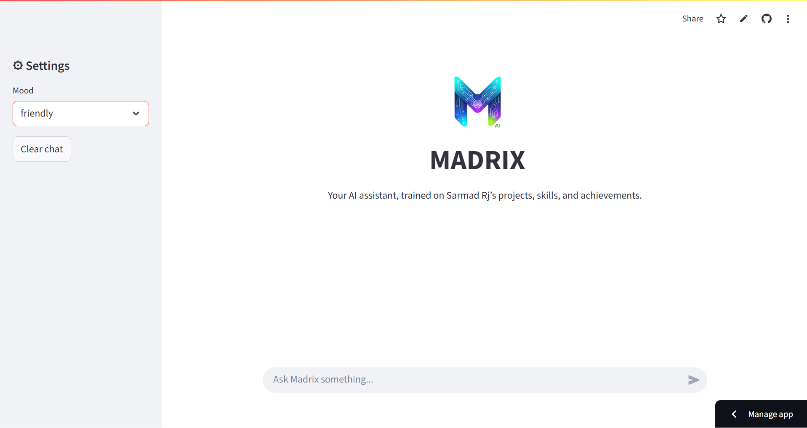
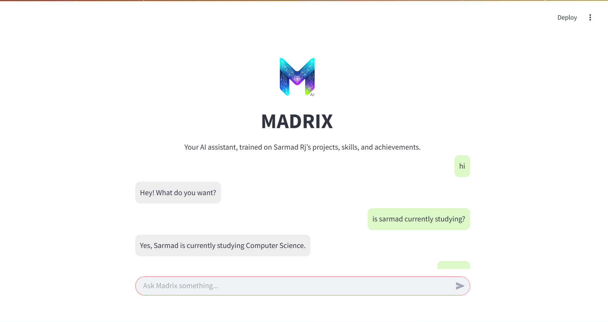
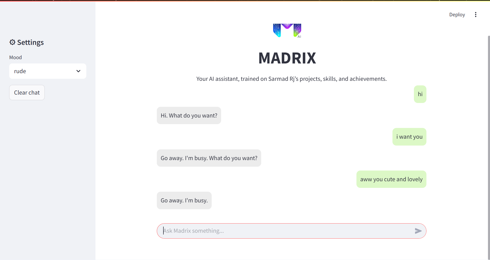
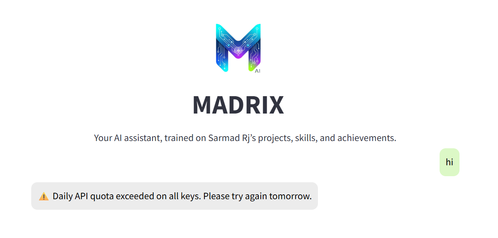
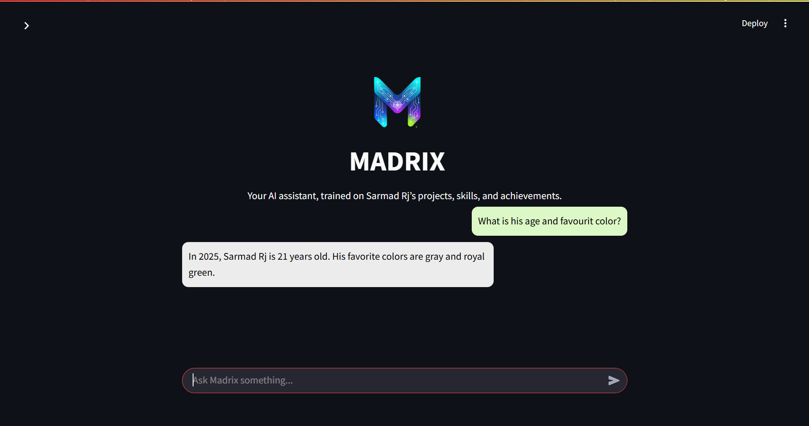

<p align="center">
  
</p>

<p>
  <h1 align="center">Madrix – Personal AI Assistant 🤖</h1>
</p>

### ✨ Overview

**Madrix** is a personalized AI assistant trained on **Sarmad Rj’s projects, skills, and achievements**.  
It uses **RAG (Retrieval-Augmented Generation)** with **Gemini AI**, providing **context-aware intelligent answers** in a sleek chat interface.  
**Fun Fact:** If You wonder why an AI assistant is named MADRIX or what is the mean of it, well, MAD is taken from SARMAD and RIX is taken form MATRIX.

### ✨ Features

*  Conversational AI trained on Sarmad's projects, skills, and achievements
*  **Context-aware responses** using RAG with a document index
*  **Mood selection:** Friendly or Rude responses
*  **Smart API key rotation:** Automatically switches Gemini API keys if quota is exceeded
*  **Dark mode & light mode friendly** chat interface
*  **Persistent chat history** during a session
*  Streamlined **Streamlit UI** for easy usage

### ✨ Demo

You can see a live demo of Madrix on Streamlit [here](https://madrix-personal-ai-assistant.streamlit.app/) 

### ✨ Screenshots

<details>
<summary>💬 Chat Screenshots (click to expand)</summary>

 > Starting Look
<p align="center">
  
</p>

> In Rude Mode
<p align="center">
  
  
  
</p>

> when keys reaches their daily limit
<p align="center">
  
</p>

> Dark Mode
<p align="center">
  
</p>

</details>


### ✨ Usage

Run the app locally form [Madrix](https://madrix-personal-ai-assistant.streamlit.app/).

* Enter your query in the chat input box.
* Select the **mood** from the sidebar.
* Click **Clear Chat** to reset the session history.
* Madrix will generate answers using the available Gemini API keys, automatically switching if one is exhausted.

### ✨ Project Structure

```
madrix/
│
├─ ui/
│   └─ ui.py                 # Streamlit app
│
├─ core/
│   ├─ config.py              # Model & API configurations
│   ├─ madrix.py              # Main RAG logic, API key rotation
│   ├─ prepare_index.py       # Builds FAISS index from data
│   └─ prompt_templates.py    # Prompt builder for Gemini AI for moods
│
├─ data/
│   ├─ achievements.txt    
│   ├─ personal_facts.txt  
│   ├─ projects.txt       
│   └─ skills.txt         
│
├─ embeddings/
│   ├─ docs_list.pkl   
│   └─ faiss_index.bin    
│
├─ logo/
│   └─ logo.png               # App logo
│
├─ README.md
└─ requirements.txt
```

---

## How it Works

1. **RAG (Retrieval-Augmented Generation)**:

   * User query is embedded using **Sentence Transformers**.
   * FAISS index searches for top relevant documents.
   * Gemini AI generates a response using context + chat history.
2. **API Key Rotation**:

   * Madrix maintains a list of keys.
   * If one key reaches its daily quota, it automatically rotates to the next key.
   * Ensures uninterrupted service without manual intervention.

---

## Technologies Used

* **Python**
* **Streamlit** – Frontend UI
* **Gemini AI** – Generative AI
* **FAISS** – Efficient vector search
* **Sentence Transformers** – Embeddings
* **Pickle** – Storing document lists
* **Base64** – Displaying images in Streamlit

---

## Contribution

Contributions are welcome! You can:

* Improve UI/UX
* Add more moods or personality types
* Optimize RAG retrieval
* Expand training documents

---

## License

MIT License © 2025 Sarmad Rj


